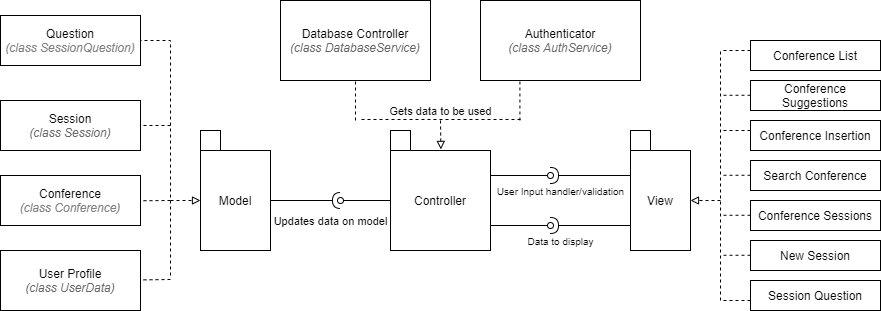
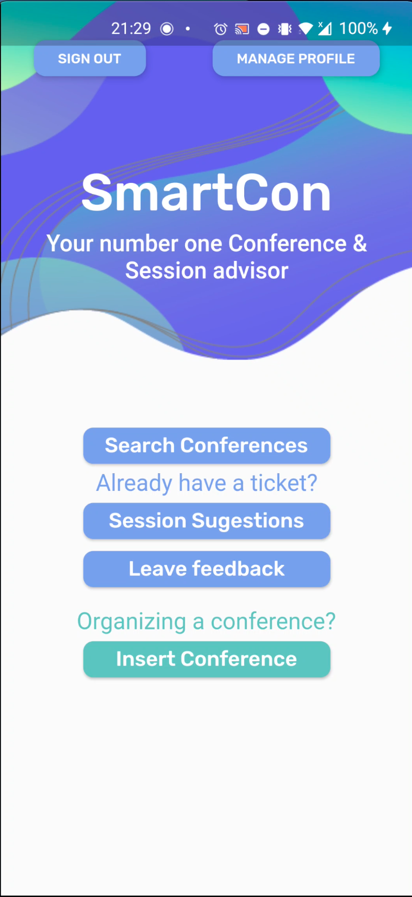

# Smartcon - *openCX*
*https://github.com/FEUP-ESOF-2020-21/open-cx-t2g3-them-d*

Welcome to the documentation pages of the **SmartCon** of openCX!

You can find here detailed information about the SmartCon, hereby mentioned as module, from a high-level vision to low-level implementation decisions, a kind of Software Development Report, organized by discipline (as of RUP): 

* Business modeling 
  * [Product Vision](#Product-Vision)
  * [Elevator Pitch](#Elevator-Pitch)
* Requirements
  * [Use Case Diagram](#Use-case-diagram)
  * [User stories](#User-stories)
  * [Domain model](#Domain-model)
* Architecture and Design
  * [Physical architecture](#Physical-architecture)
  * [Logical architecture](#Logical-architecture)
  * [Prototype](#Prototype)
* [Implementation](#Implementation)
* [Test](#Test)
* [Configuration and change management](#Configuration-and-change-management)
* [Project management](#Project-management)

### This project was developed by:
* [Diana Cristina Amaral de Freitas](https://github.com/dianaamfr)
* [Henrique Manuel Ruivo Pereira](https://github.com/GodAnri)
* [Mariana Oliveira Ramos](https://github.com/marianaramos37)
* [Tomás Freitas Gonçalves](https://github.com/tomasfgon)

---

## Product Vision

SmartCon not only simplifies conference choices by evaluating user's preferences, but also generates relevant session suggestions for a conference by assessing the knowledge level of the user on session topics.

---
## Elevator Pitch

Have you ever wondered about the main reason why attendees go to conferences? From finding solutions to problems to engaging in unique experiences, there are probably a few different answers. One of the most important and relevant is to learn. Unfortunately, it is not uncommon for attendees to feel overwhelmed while trying to navigate through many parallel sessions. That is why Smartcon focuses on users knowledge to suggest the sessions which are most relevant for the user in a given conference.


---
## Requirements

### Use case diagram


#### Manage Profile
* **Actor**: Attendee
* **Description**: This use case exists so that the attendees can specify and change their interests and location.
* **Preconditions and Post conditions**: The user must log in with google to be able to access this functionality.
* **Normal Flow**:
  1. The attendee logs in with his google account.
  2. The attendee presses a button to see conference suggestions.
  3. The attendee presses a button to manage his profile.
  4. The attendee clicks a button to save his profile.
* **Alternative Flows and Exceptions**: 
   When a new user signs up he must build his profile.
  1. The attendee presses a button to see conference suggestions.
  2. The attendee fills his profile.
  3. The attendee clicks a button to save his profile.

#### See conference recommendations
* **Actor**: Attendee
* **Description**: This use case exists so that the attendees can choose  which conference to go to from an already filtered set based on their interests, location, availability and feedback to previous editions.  
* **Preconditions and Post conditions**: In order to choose a conference from a filtered set of conferences the attendees must previously define their profile.
* **Normal Flow**: 
  1. The attendee presses a button to see conference suggestions.
  2. The attendee can select the date range and filter the conferences by rating or location by checking an checkbox.
* **Alternative Flows and Exceptions**:
  When a new user tries to get conference suggestions he his first asked to fill his profile.
  1. The attendee presses a button to see conference suggestions.
  2. The attendee fills his profile.
  3. The attendee can select the date range and filter the conferences by rating or location by checking an checkbox.

#### See session suggestions
* **Actor**: Attendee
* **Description**: This use case exists so that the attendees can see which sessions are most recommended based on their knowledge about the conference main topics.
* **Preconditions and Post conditions**: In order to see the set of filtered sessions the attendee must first enter the conference code which they have decided to attend. They must also answer the quiz provided by the conference organization.
* **Normal Flow**: 
  1. The attendee presses the button to get session suggestions.
  2. The attendee his asked for the code of the conference.
  3. The attendee enters the code of the conference.
  4. The attendee presses the button to see session suggestions.
  5. The attendee answers the quiz made by the conference organization
  6. The attendee sees the suggestions.
* **Alternative Flows and Exceptions**: 
  When the user has already filled the quiz for a conference he his directed to the suggestions that were previously obtained.
  1. The attendee presses the button to get session suggestions.
  2. The attendee his asked for the code of the conference.
  3. The attendee enters the code of the conference.
  4. The attendee sees the suggestions that were previously obtained.
  
  When the user enters an invalid conference code.
  1. The attendee presses the button to get session suggestions.
  2. The attendee his asked for the code of the conference.
  3. The attendee enters the code of the conference.
  4. The attendee gets a warning alerting that the code is invalid.

#### Give feedback
* **Actor**: Attendee
* **Description**: This use case exists so that the attendees can rate a conference they attended.
* **Preconditions and Post conditions**: In order to rate a conference it must have already occurred.
* **Normal Flow**: 
  1. The attendee presses the button to insert the code of the chosen conference.
  2. The attendee enters the code.
  3. The attendee presses the button to rate the conference.
  4. The attendee rates the conference.
* **Alternative Flows and Exceptions**: 
  When the user enters an invalid conference code.
  1. The attendee presses the button to insert the code of the chosen conference.
  2. The attendee enters the code.
  3. The attendee gets a warning alerting that the code is invalid.

#### Insert conference with quiz
* **Actor**: Conference Staff
* **Description**: This use case exists so that the conference staff can upload conferences into the database to later be presented to the attendees who will answer the quiz.
* **Preconditions and Post conditions**: In order to insert a new conference, the conference staff must first join the app. They must also choose a set of multiple choice questions whose answers will lead to a set of sessions.
* **Normal Flow**: 
  1. The conference staff presses the button to add a new conference to the app.
  2. The conference staff  types the conference information.
  3. The conference staff inserts a set of multiple choice questions.

### User stories

#### User Stories Map


#### Story I - Conference Suggestions

* **Story**
As an Attendee, I want to be able to get conference suggestions based on my profile and availability so that the set of results is straightforward and accurate.

* **User interface mockups**.

  &nbsp;&nbsp;&nbsp;&nbsp;&nbsp;&nbsp;&nbsp; 

* **Acceptance tests**.
```gherkin
Scenario: Attendee searches conferences with the profile already configured
  Given I have saved my Profile Preferences
  When I tap the Search Conferences button
  And I select a Date range
  Then I get Conference Suggestions according to Preferences and Date
  And I can sort these by Rating and Location.
```

```gherkin
Scenario: Attendee searches conferences without configuring profile
  Given I have not saved my Profile Preferences
  When I tap the Search Conferences button
  Then I will be prompted the Manage Profile form
```

* **Value and effort**.

  *Value*: Must have
  
  *Effort*: L

#### Story II - Session Suggestions

* **Story**.
As an Attendee, I want to have the possibility of getting the right session suggestions according to my knowledge level on the conference’s matter.

* **User interface mockups**.

  &nbsp;&nbsp;&nbsp;&nbsp;&nbsp;&nbsp;&nbsp;&nbsp;&nbsp;&nbsp; &nbsp;&nbsp;&nbsp;&nbsp;&nbsp; 


* **Acceptance tests**.
```gherkin
Scenario: Attendee searches session suggestions using a conference code never used before
  Given I have a valid Conference Code
  When I tap the Session Suggestions button
  And I insert the Conference Code
  Then I will be given the Quiz for the corresponding conference
  And I will get Session Suggestions according to my answers
```

```gherkin
Scenario: Attendee searches session suggestions using a conference code used before
  Given I have a valid Conference Code
  And I have already filled the Quiz for that Conference
  When I tap the Session Suggestions button
  And I insert the Conference Code
  Then I will get the previously obtained Session Suggestions
```

```gherkin
Scenario: Attendee searches session suggestions using an invalid conference code
  Given I have an invalid Conference Code
  When I tap the Session Suggestions button
  And I insert the Conference Code
  Then I will get a Warning alerting that the code is invalid
```

* **Value and effort**.

  *Value*: Must have
  
  *Effort*: XL


#### Story III - Rate Conference

* **Story**.
As an Attendee, I want to be able to rate a conference I attended to, to inform other people of my opinion on its quality and help other people when they are searching for conferences to attend to.

* **User interface mockups**. 

  &nbsp;&nbsp;&nbsp;&nbsp;&nbsp;&nbsp;&nbsp;&nbsp;&nbsp;&nbsp;&nbsp;&nbsp;&nbsp;&nbsp; 


* **Acceptance tests**.
```gherkin
Scenario: Attendee rates a conference using a conference code
  Given I have a Conference Code
  When I tap the Leave Feedback button
  And I insert the Conference Code
  Then I will be able to choose the Rating for the conference
  And Leave Feedback
```

```gherkin
Scenario: Attendee rates a conference using an invalid conference code
  Given I have an invalid Conference Code
  When I tap the Leave Feedback button
  And I insert the Conference Code
  Then I will get a Warning alerting that the code is invalid
```

* **Value and effort**.
  *Value*: Could have
  
  *Effort*: M

#### Story IV - Insert Conference

* **Story**.
As a member of the Conference staff, I want to be able to insert a conference into the app database in order to promote it to possible attendees.

* **User interface mockups**.

  &nbsp;&nbsp;&nbsp;&nbsp;&nbsp;&nbsp;&nbsp;

* **Acceptance tests**.
```gherkin
Scenario: Insert conference data
  Given I am at the Home Page
  When I tap the Insert Conference button
  Then I will be redirected to the Insert Conference page
  And I will be presented with fields to insert the name, description, category, district and dates of the conference
```

```gherkin
Feature: Lacking Conference Information
  Scenario: A pop up is shown if conference data is incomplete
    Given I am at the Insert Conference Page
    When I fill the name field with a valid name
    And I fill the description field with a description
    And I tap the Next button
    Then a popup will show saying I haven't filled all the required fields
```

* **Value and effort**.
  *Value*: Could have
  
  *Effort*: L

#### Story V - Add Sessions and Quiz to a Conference

* **Story**.
As a member of the Conference staff, I want to be able to test the attendees’ knowledge in order to have an audience that is inquisitive and capable of understanding the matter discussed in each session. 

* **User interface mockups**.

  &nbsp;&nbsp;&nbsp;&nbsp;&nbsp;&nbsp;&nbsp; &nbsp;&nbsp;&nbsp;&nbsp;&nbsp;&nbsp;&nbsp; 

* **Acceptance tests**.
```gherkin
Scenario: Conference staff member inserts a session and respective question to its conference
  Given I have filled the conference form
  When I tap the Add Session button
  Then I will be able to fill a form with the Session name, topic and relevant data
  And add a question to the Quiz related to such Session
```

* **Value and effort**.
  *Value*: Must have
  
  *Effort*: XL
  
#### Story VI - Manage Profile

* **Story**.
As an Attendee, I want to be able to change my saved interests and desired location.

* **User interface mockups**.

  

* **Acceptance tests**.
```gherkin
Scenario: Attendees can access the Manage Profile page directly from the Home page
  Given I am at the Home Page
  When I tap the Manage Profile button
  Then I will be able to set my Interests and District in the Manage Profile page
  And I will be able to Save Profile by clicking the Save Profile button
```

```gherkin
Scenario: Attendee changes his profile preferences or location
  Given I have Signed In
  And I have already configured my profile yet
  And I have clicked the Search Conferences button
  When I tap the Manage Profile button
  Then I will be redirected to the Manage Profile page
  And I will be presented with fields to choose my district and interests
  Then I will be able to save my profile by clicking the save button
```

```gherkin
Scenario: Attendee creates his profile preferences or location
  Given I have Signed In
  And I have not configured my profile yet
  When I click the  Search Conferences button
  Then I will be able to set my Interests and District
  And I will be able to Save Profile by clicking the button
```

* **Value and effort**.
  *Value*: Must have
  
  *Effort*: L


### Domain model

  

  Our app concepts are easily understood, consisting of **Conferences**, **Sessions**, **Profiles**, **Users** and **Quizzes**. 


  Each **User**, identified by an unique `id`, can be connected to a **Conference** as an attendee or organizer.
  Every attendee has a **Profile** defining his `interests` and `location`(district), which allows us to filter the available Conferences for each individual. 
  **Conferences** have related information and multiple **Sessions**. Each **Session** has one **Quiz**, which will be answered by attendees to obtain Session Suggestions. 
  Each **Quiz**, beyond the `question` and the `options`, has a `type`, which can assume the values Concept Question or Right/Wrong Question. This allows us to identify the type of answer that is expected from the **User**.
  In Concept Knowledge questions, the `required` value represents the number of concepts that the **User** is required to recognize from the options to fully enjoy the **Session**.
  In Right/Wrong questions, the `answer` value allows us to check if the **User** choose the right option and, this way, to verify if the **Session** should be suggested or not.


---


## Architecture and Design

### Logical architecture



SmartCon's app's high-level logical structure follows the Model-View-Controller Architectural Pattern (*MVC*). We chose this pattern because our app has three clear components:
- The **Controller**, a component that represents the logic and the backend of Smartcon App and that includes:
  - the connection to the Firestore Database, which allows us to access and modify the information about the users, the conferences, the sessions, the quizzes, previously obtained suggestions and also the given feedback. To enable this functionalities, this component includes the database queries, triggered according to the users' inputs.
  - the authentication with Google, which makes sure user data is safe and only accessible by the right users.
- The **Views**, visual components that represent the concrete display of each app state to the user, showing the data obtained and updated by the Controller.
- The **Models**, which include the Users, Conferences, Sessions and Quizzes. These represent entities that store related data, mapping the information obtained by the Controller. Every update on these domains is triggered by the Controller and represented in the Views.  

 Also, since we are a group of four elements we found that using this model we could work simultaneously on the model, controller, and views. Also, because of the separation of responsibilities, we found it easier to change and upgrade our app in every increment. Additionally, using *MVC* one model can have multiple views, which, since this is an app with quite some features, came in handy.


### Physical architecture

The goal of this subsection is to document the high-level physical structure of the software system.


SmartCon's app high-level physical structure consists of two main blocks and one main connection between them. 
The user installs the SmartCon app on a smartphone and every time the app needs to connect to our database it does it via HTTPS requests, where is all the information available.

For this project the main technology considered was Flutter for the mobile UI combined with Firebase to store all the data. 
We chose Flutter because of its ability to easily customize anything that appears on the screen with the ready-to-use widgets. As for the database server we used Firebase as it is of easy integration with Flutter.


### Prototype

During the initial Prototype phase, we were indecisive about the user stories and their implementations. As the ideas started to get more defined and as the product vision approached its final version, the group was able to identify the most valuable features to include:
- Enabling the user to create his profile by choosing from a list of interests and by selecting his location;
- Allowing the user to filter conferences by rating and date;
- Allowing the user to get session suggestions by answering a quiz.

This main features were then converted into user stories with great value and their effort was estimated to better understand if we could also include some other features that would enrich the final product. 
Therefore, we decided to also allow users to leave their feedback for a conference and to take a risk and commit ourselves to a feature that would take a lot of effort: allowing the organization to insert a conference with multiple sessions, speakers, topics and the quiz itself, to be answered by the user.
 
At this stage, we started to discuss about which architecture and design would be the most appropriate for the app. 
We agreed upon making the app consist of a main menu where all the main features are accessible by pressing a button, requiring no navigation bar and making the traversal straightforward and intuitive for the user.




As we started developing the app, the first concern encountered by the group was adapting to the new environment Flutter and Dart brought us. Also, has most of our app required a database and authentication to keep the user data, we started as quickly as possible to connect to Firebase and to user Google Sign In to authenticate the user.

In the first two iterations we decided to implement the user stories that clearly brought more value to the user. 
In the next to iterations we implemented the remaining stories and we made some corrections and improvements to the main features according to the feedback he had. 

Also, has we worked hard in the first three iterations so that we would be able to invest some time in extra features, we decided to allow the user to copy the code of the inserted conference and test the quiz that he just inserted, which allows all the features of the app to be tested by anyone that signs in. Furthermore, we added some pop ups to indicate when compulsory data was missing when inserting a conference, improving the user experience even more.

Finally, as we wanted to focus our work on the implementation of the features themselves, we started by implementing our app for Android, but planned on releasing a version for iOS also. In the fourth iteration, after implementing the remaining features and also the extras, we tried to release the version for iOs . Even though we had access to a Mac computer (necessary for the implementation of the iOS version), it turned out to cause major dependency problems in our app due to Firebase. Resulting in the idea being dropped and finally releasing only on Android.

---

## Implementation

Changelogs for the increments made can be found [here](https://github.com/FEUP-ESOF-2020-21/open-cx-t2g3-them-d/releases)!

---

## Test

To test our application we have decided to add Unit Tests and Automated Acceptance Tests using *gherkin*.

Acceptance tests are a formal description of the behavior of a software product, generally expressed as an example or a usage scenario. We implemented them using *Gherkin* language,  with the aid of `flutter_gherkin` package for Flutter and expressing some of the scenarios described in the [User Storys Chapter](#User-stories).

Unit Tests are a way of testing a unit (the smallest piece of code that can be logically isolated in a system) and we implemented them using the `flutter_test` dependency.

In this project we decided to mainly focus our tests on:

- Tapping buttons to show another screen, verifying the flow between screens.
- Presence of certain widgets to verify the construction of each screen class.
- Verification of input errors.
- Code that could be tested independently of the authentication with Google Sign In.


#### The features tested are the following:

**Acceptance Tests**:
- Insert Conference - [User Story IV](#Story-IV---Insert-Conference): We decided to test this feature due to the multiplicity of fields and pages it involves.
- Pop-up mentioning error when inputs are invalid - Extra Feature - [Issue #19](https://github.com/FEUP-ESOF-2020-21/open-cx-t2g3-them-d/issues/19). We added this extra feature in the last iteration and we wanted to make sure it worked as expected, identifying when the user did not fill all compulsory fields regarding the conference he is trying to insert.
- Manage Profile - [User Story VI](#Story-VI---Manage-Profile). Even though the Manage Profile feature involves requests to the firebase, which made it tricky to test, we decided to test it with a test user because it is essencial that a user can access his profile data, which must have the location and interests sections.

**Unit Tests**:

In the Unit Tests we focused our tests on the features related to the Insertion of a Conference, because it involves some screens that do not require firebase authentication and, therefore, were totally dependent on our Flutter code.
- Insert Conference Screen - [User Story V](#Story-V---Add-Sessions-and-Quiz-to-a-Conference).
- Pop-up mentioning error when inputs are invalid - [Issue #19](https://github.com/FEUP-ESOF-2020-21/open-cx-t2g3-them-d/issues/19);
- Conference Sessions Screen - [User Story V](#Story-V---Add-Sessions-and-Quiz-to-a-Conference);
- Pressing the button to add a Session - [User Story V](#Story-V---Add-Sessions-and-Quiz-to-a-Conference);
- Pressing the button to add the Conference generates error if no session are inserted - [User Story IV](#Story-IV---Insert-Conference);
- New Session Screen - [User Story V](#Story-V---Add-Sessions-and-Quiz-to-a-Conference);
- Insert Speakers and Topics of a Session Screen - [User Story V](#Story-V---Add-Sessions-and-Quiz-to-a-Conference).


---

## Configuration and change management

Configuration and change management are key activities to control change to, and maintain the integrity of, a project’s artifacts. For the purpose of ESOF, we used a very simple approach, just to manage feature requests, bug fixes, and improvements, using GitHub issues and following the [GitHub flow](https://guides.github.com/introduction/flow/).

---

## Project management

For this project, we used Github Projects in order to register the tasks, assign tasks to the members of the group, add estimations to tasks and monitor tasks progress. You can see our board [here](https://github.com/FEUP-ESOF-2020-21/open-cx-t2g3-them-d/projects/1).

---

## Evolution - contributions to openCX

In order to contribute to openCX, our app is able to provide personalized Session Suggestions for previous filtered Conferences based on the level of knowledge of the user, which ends up being the most innovating feature of our mobile app.

Each attendee can choose a conference that fits his interests and availability but, most of all, he can then answer the quiz of that Conference. His answers will be used by the app to provide one or more Session Suggestions according to the proficiency level on the topics of each Session.

We feel SmartCon and this feature in particular have potencial to integrate the Open-CX, to grow even more with new types of questions and to be combined with other features developed by other groups to create an app that greatly improves the user experience in conferences and events.